# SYSTEM DESIGN — Pinteresto (Finisher Tech AI) v3
### Pinterest Automation System — Complete Architecture Document
**Version:** v3 (70/30 Routing Architecture) | **Updated:** April 2026

---

## SECTION 1 — SYSTEM KA BIRDS EYE VIEW

### Yeh system kya karta hai?

**Pinteresto** ek fully autonomous Pinterest marketing machine hai.  
Iska ek hi kaam hai: **bina kisi human input ke, din mein 6 Pinterest pins post karna** — 2 accounts par, 3 pins each — real analytics padh ke, AI se strategy banake, aur automatically post karke.

### 3-Node Mastermind Pipeline (v3)

```
┌─────────────────────────────────────────────────────────────────────┐
│                     MASTERMIND CEO PIPELINE                         │
│                                                                     │
│  [Node 1]              [Node 2]              [Node 3]               │
│  node_data       →     node_cmo        →     node_agent             │
│  intelligence          mastermind            executor               │
│                                                                     │
│  Google Sheets         Gemini 2.5            agent.py               │
│  se analytics          Flash Lite            (LangGraph             │
│  padhta hai            CMO brain             tool agent)            │
│                        70/30 routing                                │
└─────────────────────────────────────────────────────────────────────┘
```

**v2 se v3 mein kya badla:**
- Node 3 (Fast Copywriters) REMOVED — CMO ab khud hi copy likhta hai
- Node 4 (Execution Engine) REMOVED — agent.py directly execute karta hai
- I2I (Image-to-Image) REMOVED — affiliate pins ab raw product photo use karte hain
- 70/30 routing ADDED — Gemini ab VIRAL_PIN ya AFFILIATE_PIN decide karta hai

---

## SECTION 2 — COMPLETE VISUAL FLOWCHART (Mermaid.js)

```mermaid
flowchart TD
    A([🕐 APScheduler Trigger\nAccount1: 10AM–4PM EST — 3 random slots\nAccount2: 7PM–1AM EST — 3 random slots]) --> B

    B[main.py\nmastermind_scheduled_job] --> C

    subgraph MASTERMIND["🧠 MASTERMIND CEO GRAPH — mastermind/graph.py"]
        direction TB

        C[NODE 1 — node_data_intelligence\nGoogle Sheets se 7-day analytics padhta hai\nSheet1: Analytics_Log — Acc1 HomeDecor\nSheet2: Analytics_logs2 — Acc2 Tech\nMetrics: impressions, clicks, saves, outbound] --> D

        D{Gemini API\nAvailable?}
        D -->|Yes| E[NODE 2 — node_cmo_mastermind\nGemini 2.5 Flash Lite\nAnalytics profile compute karo\nHigh-Impression/Low-Engagement or Stagnant or Conversion-Ready]
        D -->|No — All retries failed| FB[Hardcoded VIRAL_PIN Fallback\nPipeline kabhi nahi rukti ✅]

        E --> R1[70/30 Routing per Account\nrandom.choices — weights 70 percent 30 percent\nEach account independently decided]

        R1 -->|70 percent| VP[VIRAL_PIN Prompt to Gemini\nOutput: title, aesthetic description\ntags, detailed visual_prompt for T2I]
        R1 -->|30 percent| AP[AFFILIATE_PIN Prompt to Gemini\nOutput: title, CTA description\ntags, visual_prompt = NONE]

        VP --> CMO_OUT[CMO Strategy JSON\npin_type + strategy + vibe\ntitle + description + tags + visual_prompt]
        AP --> CMO_OUT
        FB --> CMO_OUT

        CMO_OUT --> H[NODE 3 — node_agent_executor\nStrategy → agent.py run_agent\nAcc1 trigger — account1\nAcc2 trigger — account2]
    end

    H --> I

    subgraph AGENT["🤖 LANGGRAPH AGENT — agent.py"]
        direction TB

        I[System Prompt Inject\nCMO brief injected — pin_type, strategy, visual_prompt\nGroq LLM tool-calling mode\nFallback: Cerebras] --> J

        J[STEP 1: fill_missing_niches\nSheet mein empty niche products scan karo\nGroq se classify karo\nsleep 2.5s between calls] --> K

        K[STEP 2: analyze_niche_stock\nAccount ke niches check karo\nCount PENDING products\nSelect target niche] --> L

        L{needs_fetching?}
        L -->|TRUE — Stock Low| M[STEP 3: fetch_aliexpress_products\nAmazon RapidAPI call\n20 raw products fetch\nGroq filter karo\nAffiliate link append\nGoogle Sheet mein save]
        L -->|FALSE — Stock OK| N

        M --> N[STEP 4: publish_next_pin niche\nGoogle Sheet se PENDING product fetch\nCMO strategy read karo]
    end

    N --> PIN_ROUTE

    subgraph PIN_ROUTE["📌 PIN ROUTING — 70/30 Logic"]
        direction LR

        PR{pin_type\nfrom CMO?}

        PR -->|VIRAL_PIN| VPR[T2I Image Generation\nAffiliate Link STRIPPED\nvisual_prompt used for generation]
        PR -->|AFFILIATE_PIN| APR[Raw Product Image Used\nAffiliate Link KEPT\nNo AI image generated]

        VPR --> T2I_P[PRIMARY: Pollinations.ai\nGET pollinations.ai/p/encoded_prompt\nwidth=1024 height=1792\nmodel=flux seed=random]
        T2I_P -->|Success| IMGBB
        T2I_P -->|Fail| T2I_FB[FALLBACK: Puter.js free tier\nclient.ai_txt2img prompt\nmodel=pollinations-image]
        T2I_FB -->|Success| IMGBB
        T2I_FB -->|Fail| RAW_FB[LAST RESORT: Raw product image\nNo affiliate link still]
        RAW_FB --> IMGBB

        APR --> RAW_DL[Download raw image_url\nhttpx.AsyncClient GET\nAmazon product photo bytes]
        RAW_DL --> IMGBB

        IMGBB[ImgBB Mandatory Upload\nPOST api.imgbb.com/1/upload\nbase64 encoded bytes\nexpiration=1800 seconds — 30 min\nReturns: i.ibb.co URL]
    end

    IMGBB --> WH[Make.com Webhook\nPOST MAKE_WEBHOOK_URL\nPayload: image_url, title, caption, link, board_id\nAccount1: HomeDecor boards\nAccount2: Tech boards]

    WH --> DONE([📌 Pinterest Pin Live!\nmark_as_posted — Google Sheet\nStatus = POSTED])

    subgraph SHEETS["📊 Google Sheets — Central Database"]
        direction LR
        GS1[Approved Deals\nproduct_name, affiliate_link\nimage_url, niche, Status PENDING or POSTED]
        GS2[Analytics_Log — Account1 HomeDecor]
        GS3[Analytics_logs2 — Account2 Tech]
    end

    C --> GS2
    C --> GS3
    M --> GS1
    DONE --> GS1
```



---

## SECTION 3 — NODE BY NODE BREAKDOWN

### Node 1 — `node_data_intelligence`

```
File: mastermind/node_data.py
Input: MastermindState (empty analytics lists)
Output: a1_raw_analytics, a2_raw_analytics (7-day rows from Sheets)

Kya karta hai:
  1. gspread se Google Sheets connection banata hai (GOOGLE_CREDS_JSON)
  2. Analytics_Log sheet padhta hai — Account 1
  3. Analytics_logs2 sheet padhta hai — Account 2
  4. Last 7 rows return karta hai dono ke liye
  5. Agar Sheets fail ho → fallback row inject karta hai (pipeline nahi rukti)

Output format:
  [
    { "Date": "2026-04-10", "Impressions": "12453", "Clicks": "234",
      "Outbound Clicks": "89", "Saves": "178" },
    ... (7 rows)
  ]
```

---

### Node 2 — `node_cmo_mastermind` (Main Brain)

```
File: mastermind/node_cmo.py
Model: Google Gemini 2.5 Flash Lite
Input: a1_raw_analytics, a2_raw_analytics
Output: a1_cmo_strategy, a2_cmo_strategy (per-account JSON)

Kya karta hai:
  1. _compute_metrics() — 7-day averages calculate karta hai
     Profile assign karta hai:
       "High-Impression / Low-Engagement"  → impressions>5000, clicks<100, saves<100
       "High-Engagement / Conversion-Ready" → clicks>200 ya saves>200
       "Stagnant"                           → baaki sab cases

  2. _choose_pin_type() — 70/30 routing
     random.choices(["VIRAL_PIN", "AFFILIATE_PIN"], weights=[70, 30], k=1)
     Dono accounts ke liye independently decide hota hai

  3. Gemini ko appropriate prompt bhejta hai:
     VIRAL_PIN prompt   → aesthetic content, visual_prompt for T2I generation
     AFFILIATE_PIN prompt → CTA copy, visual_prompt = "NONE"

  4. Tenacity retry — 3 attempts, 12s → 24s → 48s backoff
     (Gemini 5 RPM rate limit handle karne ke liye)

  5. Failure pe hardcoded VIRAL_PIN fallback inject karta hai

Output per account:
  {
    "pin_type":     "VIRAL_PIN" | "AFFILIATE_PIN",
    "strategy":     "Visual Pivot" | "Aggressive Affiliate Strike",
    "vibe":         "short aesthetic command <120 chars",
    "title":        "SEO optimized title <100 chars",
    "description":  "Pinterest description <400 chars",
    "tags":         ["tag1", "tag2", "tag3", "tag4", "tag5"],
    "visual_prompt": "detailed T2I prompt" | "NONE"
  }
```

---

### Node 3 — `node_agent_executor`

```
File: mastermind/graph.py (inline node)
Input: a1_cmo_strategy, a2_cmo_strategy
Output: a1_publish_status, a2_publish_status

Kya karta hai:
  1. Account 1 ke liye run_agent(trigger="account1", cmo_strategy=a1_strategy)
  2. Account 2 ke liye run_agent(trigger="account2", cmo_strategy=a2_strategy)
  3. Dono results publish status mein store karta hai
```

---

### LangGraph Agent — `agent.py`

```
Architecture: StateGraph — "agent" node ↔ "tools" node loop

LLM: ChatGroq(Llama 3.3 70B).bind_tools(ALL_TOOLS)
     .with_fallbacks([ChatOpenAI(Cerebras)])

Tools registered:
  1. fill_missing_niches     → classify products without niche
  2. analyze_niche_stock     → pick target niche, check stock
  3. fetch_aliexpress_products → Amazon API + filter + save
  4. publish_next_pin        → 70/30 routing + image + webhook

Loop logic:
  agent → should_continue() → "tools" if tool_calls present
                             → END    if no tool calls
  tools → agent (return tool result to LLM)
  Max iterations: 16 (loop guard)
```

---

## SECTION 4 — TOOLS DEEP DIVE

### `tools/llm.py` — LLM Wrapper

```
def chat(prompt: str, system: str = "", temperature: float = 0.7) -> str

Priority: Groq (primary) → Cerebras (fallback)
Safety:   str() coercion on all message content (prevents 400/422 errors)

Models:
  Groq:     llama-3.3-70b-versatile
  Cerebras: llama3.3-70b
```

---

### `tools/image_creator.py` — T2I Pipeline

```
Public functions:
  generate_pin_image(visual_prompt)   → ImgBB URL (for VIRAL_PIN)
  upload_raw_image(image_url)         → ImgBB URL (for AFFILIATE_PIN)

Primary T2I — _t2i_gemini(prompt):
  Model:  gemini-2.5-flash-image  (set via GEMINI_IMAGE_MODEL in config.py)
  API:    client.models.generate_content(
              model=GEMINI_IMAGE_MODEL,
              contents=enhanced_prompt,
              config=GenerateContentConfig(response_modalities=["IMAGE"])
          )
  Ratio:  9:16 portrait — optimal for Pinterest pins
  Output: response.candidates[0].content.parts → inline_data.data
          (bytes or base64 string depending on SDK version — both handled)

  ── RATE LIMITING (free tier: 15 RPM / 1,500 RPD) ──────────────────
  Strategy: Mandatory 60-second asyncio.sleep() in `finally` block
            Runs after EVERY request — success OR failure
            Result: max 1 request/minute (well within 15 RPM limit)
            No token bucket or sliding window needed — simple & auditable

  ── Rate limit visual ───────────────────────────────────────────────
  Request → [Gemini processes ~5-15s] → Response received
       └─ finally block: asyncio.sleep(60) ← always runs
       Next request allowed only after 60s gap
  ────────────────────────────────────────────────────────────────────

Fallback T2I — _t2i_puter_free(prompt):
  PuterClient().login(PUTER_USERNAME, PUTER_PASSWORD)
  client.ai_txt2img(prompt, model="pollinations-image")
  No rate-limit delay — Puter has no strict RPM limits
  Called only when Gemini returns no image or is not configured

ImgBB upload — _upload_to_imgbb(bytes):
  POST api.imgbb.com/1/upload
  { key: IMGBB_API_KEY, image: base64(bytes), expiration: 1800 }
  Returns: "https://i.ibb.co/xxxxx/image.jpg"

Raw image flow — upload_raw_image(url):
  1. httpx GET raw product image URL
  2. _upload_to_imgbb(bytes)
  Used by AFFILIATE_PIN — no AI generation, no rate limiting

Key design decision:
  ImgBB is MANDATORY — Pinterest requires a stable public URL.
  Amazon CDN URLs expire and get throttled by Pinterest.
  ImgBB provides 30-min guaranteed public access for webhook delivery.
```

---

### `tools/google_drive.py` — Google Sheets CRUD

```
Sheet: "Approved Deals" (SHEET_NAME in config.py)

Functions:
  get_pending_products(limit, allowed_niches) → filtered PENDING products
  get_products_without_niche()               → products needing classification
  count_pending()                            → total PENDING count
  save_products(products)                    → append new products
  mark_as_posted(product_name)               → Status = "POSTED"
  update_niche(product_name, niche)          → set niche column

Connection:
  GOOGLE_CREDS_JSON → json.loads() → gspread.service_account_from_dict()
  SPREADSHEET_ID    → spreadsheet.worksheet(SHEET_NAME)
```

---

### `tools/make_webhook.py` — Pinterest Bridge

```
async def post_to_pinterest(image_url, title, description, link,
                             tags, niche, target_account) -> bool

Account selection:
  target_account → exact name match in PINTEREST_ACCOUNTS
  Falls back to first account if not found

Board selection:
  account["boards"][niche] → board-specific ID
  Falls back to account["boards"]["default"]

Payload:
  {
    "image_url": "https://i.ibb.co/...",
    "title":     title[:100],
    "caption":   description + "\n\n" + "#tag1 #tag2 ...",
    "link":      affiliate_link | "",
    "board_id":  "909445787192891736"
  }

Pinterest boards configured:
  Account1 (HomeDecor): home, kitchen, cozy, gadgets, organize
  Account2 (Tech):      tech, budget, phone, smarthome, wfh
```

---

## SECTION 5 — DATA LIFECYCLE EXAMPLES

### Example A — VIRAL_PIN Journey (70% of runs)

```
[TRIGGER — 2:14 PM EST, random slot]

1. Analytics read:
   Account 1 — impressions_avg: 1,200 | clicks_avg: 45 | profile: "Stagnant"

2. CMO decision:
   random.choices → VIRAL_PIN (70% probability won)
   Gemini VIRAL prompt output:
   {
     "pin_type": "VIRAL_PIN",
     "strategy": "Visual Pivot",
     "title": "5 Cozy Kitchen Touches That Feel Like a Hug ✨",
     "description": "Transform your kitchen into the coziest corner of your home...",
     "tags": ["CozyKitchen", "HomeAesthetic", "KitchenGoals", "CozyVibes", "HomeDecor"],
     "visual_prompt": "Cozy kitchen flat-lay, ceramic mugs, warm golden steam,
                       marble surface, linen cloth, soft bokeh, 8k hyperrealistic"
   }

3. agent.py:
   fill_missing_niches → 0 updated
   analyze_niche_stock → niche="kitchen", needs_fetching=False
   publish_next_pin(niche="kitchen")

4. VIRAL_PIN routing:
   affiliate_link = ""  ← STRIPPED
   Pollinations.ai call → 1,024×1,792 aesthetic image → 847KB bytes

5. ImgBB upload → https://i.ibb.co/mBxK2p/viral_cozy.jpg

6. Make.com webhook:
   { image_url: "i.ibb.co/...", title: "5 Cozy Kitchen...",
     caption: "Transform your kitchen...\n\n#CozyKitchen #HomeAesthetic...",
     link: "",  ← no affiliate link
     board_id: "909445787192891736" }

7. Pinterest pin posted → mark_as_posted → Status = "POSTED" ✅
```

---

### Example B — AFFILIATE_PIN Journey (30% of runs)

```
[TRIGGER — 8:43 PM EST, random slot]

1. Analytics read:
   Account 2 — clicks_avg: 320 | saves_avg: 280 | profile: "High-Engagement / Conversion-Ready"

2. CMO decision:
   random.choices → AFFILIATE_PIN (30% probability won)
   Gemini AFFILIATE prompt output:
   {
     "pin_type": "AFFILIATE_PIN",
     "strategy": "Aggressive Affiliate Strike",
     "title": "This $29 Smart Plug Pays for Itself in a Week 💡",
     "description": "Cut your energy bill instantly. Control every device from your phone.
                     Shop via link in bio before it sells out.",
     "tags": ["SmartHome", "TechDeals", "HomeAutomation", "BudgetTech", "SmartPlug"],
     "visual_prompt": "NONE"
   }

3. agent.py:
   fill_missing_niches → 2 updated
   analyze_niche_stock → niche="smarthome", needs_fetching=False
   publish_next_pin(niche="smarthome")

4. AFFILIATE_PIN routing:
   affiliate_link = "amazon.com/dp/B08XYZ?tag=swiftmart0008-20" ← KEPT
   No AI image generated
   Download raw image_url from product data → 423KB bytes

5. ImgBB upload → https://i.ibb.co/kQpR7x/smart_plug.jpg

6. Make.com webhook:
   { image_url: "i.ibb.co/...", title: "This $29 Smart Plug...",
     caption: "Cut your energy bill... #SmartHome #TechDeals...",
     link: "amazon.com/dp/B08XYZ?tag=swiftmart0008-20",  ← affiliate link active
     board_id: "1093952634426985795" }

7. Pinterest pin posted → mark_as_posted → Status = "POSTED" ✅
```

---

## SECTION 6 — RELIABILITY & FALLBACK MATRIX

```
┌──────────────────┬───────────────────────┬────────────────────────────────┐
│ Component        │ Primary               │ Fallback                       │
├──────────────────┼───────────────────────┼────────────────────────────────┤
│ LLM (chat)       │ Groq Llama 3.3 70B    │ Cerebras Llama 3.3 70B         │
│ LLM (agent)      │ ChatGroq              │ ChatOpenAI → Cerebras endpoint  │
│ CMO Brain        │ Gemini 2.5 Flash Lite │ Hardcoded VIRAL_PIN strategy    │
│                  │ (3 retries: 12/24/48s)│                                │
│ T2I Image        │ Pollinations.ai       │ Puter.js free tier             │
│ T2I (last resort)│ Puter.js              │ Raw product image (no gen)     │
│ Google Sheets    │ gspread connection    │ Fallback row injected          │
│ Analytics        │ Live 7-day data       │ {"Date":"fallback"} → Stagnant │
└──────────────────┴───────────────────────┴────────────────────────────────┘

Pipeline NEVER stops — every single node has a fallback path.
```

---

## SECTION 7 — ANALYTICS PROFILE → STRATEGY MAPPING

```
Analytics Profile Computation (_compute_metrics):

  impressions_avg = average of last 7 days Impressions column
  clicks_avg      = average of last 7 days Clicks column
  saves_avg       = average of last 7 days Saves column

  IF impressions_avg > 5000 AND clicks_avg < 100 AND saves_avg < 100:
      profile = "High-Impression / Low-Engagement"
      → Content dekha ja raha hai but engage nahi ho raha
      → VIRAL_PIN more likely (algorithm ko engage signal chahiye)

  ELIF clicks_avg > 200 OR saves_avg > 200:
      profile = "High-Engagement / Conversion-Ready"
      → Audience warm hai → AFFILIATE_PIN aur effective hoga
      → 30% chance already hai, Gemini context mein bold CTA likhega

  ELSE:
      profile = "Stagnant"
      → Account slow hai → VIRAL_PIN dominant (trust rebuild)

Note: Profile sirf Gemini ke PROMPT mein context deta hai.
      Routing (70/30) ALWAYS random.choices se hoti hai.
      Gemini analytics ko padhke COPY style adjust karta hai.
```

---

## SECTION 8 — KEY FILES REFERENCE

| File | Role | Key Dependencies |
|------|------|-----------------|
| `main.py` | FastAPI server + APScheduler + API endpoints + AI chat | `mastermind/graph.py`, `tools/llm.py` |
| `agent.py` | LangGraph tool-calling execution agent (v3) | All tools, LangGraph |
| `config.py` | Centralized environment variable definitions | `python-dotenv` |
| `mastermind/graph.py` | 3-node LangGraph pipeline + run_mastermind() entry point | All nodes |
| `mastermind/state.py` | MastermindState TypedDict — isolated per-account state | typing_extensions |
| `mastermind/node_data.py` | Reads analytics from Google Sheets | `tools/google_drive.py` |
| `mastermind/node_cmo.py` | Gemini CMO — 70/30 routing + content generation | `google-genai`, tenacity |
| `tools/llm.py` | Unified LLM wrapper (Groq → Cerebras) with str() safety | `groq`, `cerebras-cloud-sdk` |
| `tools/aliexpress.py` | Amazon product search via RapidAPI | `httpx`, `RAPIDAPI_KEY` |
| `tools/admitad.py` | Affiliate link builder (Amazon tag appender) | `AMAZON_STORE_ID` |
| `tools/google_drive.py` | Google Sheets CRUD — product DB + analytics reads | `gspread`, `google-auth` |
| `tools/groq_ai.py` | Product filter + fallback SEO copy generator | `tools/llm.py` |
| `tools/image_creator.py` | T2I pipeline (Pollinations → Puter) + ImgBB upload | `httpx`, `putergenai` |
| `tools/make_webhook.py` | Pinterest poster via Make.com webhook | `httpx`, `config.PINTEREST_ACCOUNTS` |

---

## SECTION 9 — ENVIRONMENT VARIABLES COMPLETE LIST

```bash
# ── LLM APIs ──────────────────────────────────────────────────────────
GROQ_API_KEY           # Groq API key — primary LLM (Llama 3.3 70B)
CEREBRAS_API_KEY       # Cerebras API key — fallback LLM
GEMINI_API_KEY         # Google Gemini key — CMO Mastermind brain

# ── Product Sourcing ───────────────────────────────────────────────────
RAPIDAPI_KEY           # RapidAPI key — Amazon product search endpoint

# ── Google Sheets ──────────────────────────────────────────────────────
GOOGLE_CREDS_JSON      # Full service account JSON (json.dumps of the file)
SPREADSHEET_ID         # Google Spreadsheet ID (from sheet URL)

# ── Image Pipeline ──────────────────────────────────────────────────────
IMGBB_API_KEY          # ImgBB API key — mandatory upload gateway
PUTER_USERNAME         # Puter.js account username (T2I fallback)
PUTER_PASSWORD         # Puter.js account password (T2I fallback)

# ── Pinterest via Make.com ─────────────────────────────────────────────
MAKE_WEBHOOK_URL       # Make.com webhook URL — Account 1 (HomeDecor)
MAKE_WEBHOOK_URL_2     # Make.com webhook URL — Account 2 (Tech)
```

---

## SECTION 10 — SCHEDULER DESIGN

```
main.py APScheduler (AsyncIOScheduler, timezone=America/New_York)

Jobs configured at startup:
  1. "daily_randomizer" — cron: hour=8, minute=0
     Calls schedule_random_pins() every day at 8 AM EST
     Clears old random_ jobs and sets 6 new random slots

  schedule_random_pins() logic:
    Account 1 slots (3x): 10:00 AM + random(0-360 min) → max 4:00 PM
    Account 2 slots (3x): 7:00 PM  + random(0-360 min) → max 1:00 AM

  Each slot calls mastermind_scheduled_job(trigger=...)
  → trigger="scheduled-account1" | "scheduled-account2"

Concurrency guard:
  IF state["mastermind_running"] == True:
      logger.warning("Already running. Skipping.")
      return
  → Prevents overlapping runs from multiple random slots
```

---

## SECTION 11 — WEB DASHBOARD & API ENDPOINTS

```
FastAPI app served at port 5000

Static frontend: static/index.html
  → Real-time stats display
  → Manual trigger buttons
  → AI chat interface (Hinglish — uses Groq LLM)

REST Endpoints:
  GET  /                          → index.html dashboard
  GET  /api/stats                 → product counts + posting stats
  GET  /api/mastermind/stats      → pipeline status + scheduled slots
  GET  /api/products              → first 50 products from Sheet
  POST /api/mastermind/run        → trigger both accounts manually
  POST /api/mastermind/run-account1 → trigger Account 1 only
  POST /api/mastermind/run-account2 → trigger Account 2 only
  POST /api/mastermind/stop       → graceful stop signal
  POST /api/fetch-products        → fetch new Amazon products
  POST /api/fill-niches           → classify untagged products
  POST /api/chat                  → AI chat (detects commands in message)

Chat system:
  System prompt: PINTERESTO AI assistant (Hinglish persona)
  Command detection: "mastermind", "account 1", "stop", "status" etc.
  Action triggers: [ACTION:action_name] tag parsed from LLM response
  Background execution: actions run via FastAPI BackgroundTasks
```

---

## SECTION 12 — DEPLOYMENT

```
Replit deployment (production):
  gunicorn --bind=0.0.0.0:5000 --reuse-port
           --worker-class uvicorn.workers.UvicornWorker main:app

Docker (Hugging Face Spaces / self-hosted):
  See Dockerfile in project root

Port mapping:
  Internal: 5000
  External: 80 (Replit proxied)

Production environment variables:
  Set via Replit Secrets panel (never hardcode in source)
```

---

*PINTERESTO v3 — Finisher Tech AI*  
*Architecture by Lead Systems AI | Last updated: April 2026*
