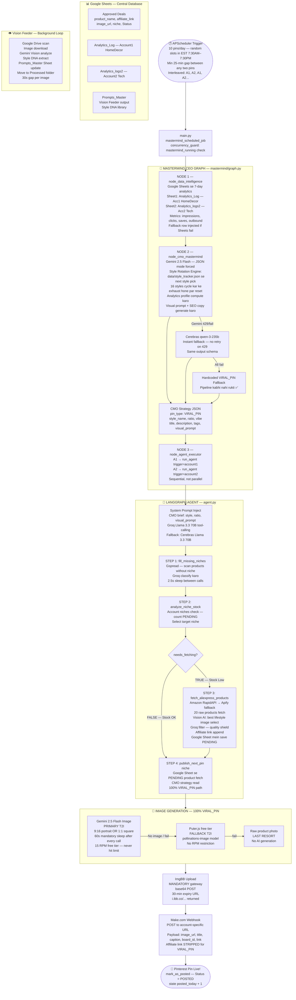

# SYSTEM DESIGN — Pinteresto (Finisher Tech AI) v3
### Pinterest Automation System — Complete Architecture Document
**Version:** v3 (100% VIRAL_PIN + Sequential Style Rotation) | **Updated:** May 2026

---

## SECTION 1 — SYSTEM KA BIRDS EYE VIEW

### Yeh system kya karta hai?

**Pinteresto** ek fully autonomous Pinterest marketing machine hai.  
Iska kaam hai: **bina kisi human input ke, din mein 10 Pinterest pins post karna** — 2 accounts par, 5 pins each — real analytics padh ke, AI se aesthetic strategy banake, visually stunning images generate karke, aur automatically post karke.

### Core Philosophy

> "Human ne sirf system design kiya. Baaki sab AI karta hai."

Yeh system ek **Digital Marketing Agency ka automated version** hai — jo 24/7 chalta hai, thakta nahi, aur har din apni strategy analytics ke basis par khud decide karta hai.

### 3-Node Mastermind Pipeline (v3)

```
┌─────────────────────────────────────────────────────────────────────┐
│                     MASTERMIND CEO PIPELINE                         │
│                                                                     │
│  [Node 1]              [Node 2]              [Node 3]               │
│  node_data       →     node_cmo        →     node_agent             │
│  intelligence          mastermind            executor               │
│                                                                     │
│  Google Sheets         Gemini 2.5            agent.py               │
│  se analytics          Flash CMO             (LangGraph             │
│  padhta hai            brain — style         tool agent)            │
│                        rotation engine                              │
└─────────────────────────────────────────────────────────────────────┘
```

**v2 se v3 mein kya badla:**
- 100% VIRAL_PIN strategy — sab AI-generated aesthetic images
- 16 curated visual styles — sequential rotation engine (no repetition)
- Style tracker persists in `data/style_tracker.json`
- Image ratio randomization — 70% portrait (9:16), 30% square (1:1)
- CMO: Gemini 2.5 Flash primary, Cerebras qwen-3-235b fallback
- Scheduler: 10 pins/day (5 per account), min 25-min gap enforced

---

## SECTION 2 — COMPLETE VISUAL FLOWCHART


```mermaid
flowchart TD
    A([🕐 APScheduler Trigger\n10 pins/day — random slots in EST 7:30AM–7:30PM\nMin 25-min gap between any two pins\nInterleaved: A1, A2, A1, A2...]) --> B

    B[main.py\nmastermind_scheduled_job\nconcurrency_guard: mastermind_running check] --> C

    subgraph MASTERMIND["🧠 MASTERMIND CEO GRAPH — mastermind/graph.py"]
        direction TB

        C[NODE 1 — node_data_intelligence\nGoogle Sheets se 7-day analytics\nSheet1: Analytics_Log — Acc1 HomeDecor\nSheet2: Analytics_logs2 — Acc2 Tech\nMetrics: impressions, clicks, saves, outbound\nFallback row injected if Sheets fail] --> D

        D[NODE 2 — node_cmo_mastermind\nGemini 2.5 Flash — JSON mode forced\nStyle Rotation Engine:\n  data/style_tracker.json se next style pick\n  16 styles cycle kar ke exhaust hone par reset\nAnalytics profile compute karo\nVisual prompt + SEO copy generate karo]

        D -->|Gemini 429/fail| DCERE[Cerebras qwen-3-235b\nInstant fallback — no retry on 429\nSame output schema]
        DCERE -->|All fail| FB[Hardcoded VIRAL_PIN Fallback\nPipeline kabhi nahi rukti ✅]

        D --> CMO_OUT[CMO Strategy JSON\npin_type: VIRAL_PIN\nstyle_name, ratio, vibe\ntitle, description, tags, visual_prompt]
        DCERE --> CMO_OUT
        FB --> CMO_OUT

        CMO_OUT --> H[NODE 3 — node_agent_executor\nA1 → run_agent trigger=account1\nA2 → run_agent trigger=account2\nSequential, not parallel]
    end

    H --> I

    subgraph AGENT["🤖 LANGGRAPH AGENT — agent.py"]
        direction TB

        I[System Prompt Inject\nCMO brief: style, ratio, visual_prompt\nGroq Llama 3.3 70B tool-calling\nFallback: Cerebras Llama 3.3 70B] --> J

        J[STEP 1: fill_missing_niches\nGspread — scan products without niche\nGroq classify karo\n2.5s sleep between calls] --> K

        K[STEP 2: analyze_niche_stock\nAccount niches check — count PENDING\nSelect target niche] --> L

        L{needs_fetching?}
        L -->|TRUE — Stock Low| M[STEP 3: fetch_aliexpress_products\nAmazon RapidAPI → Apify fallback\n20 raw products fetch\nVision AI: best lifestyle image select\nGroq filter — quality shield\nAffiliate link append\nGoogle Sheet mein save PENDING]
        L -->|FALSE — Stock OK| N

        M --> N[STEP 4: publish_next_pin niche\nGoogle Sheet se PENDING product fetch\nCMO strategy read\n100% VIRAL_PIN path]
    end

    N --> T2I

    subgraph T2I["🎨 IMAGE GENERATION — 100% VIRAL_PIN"]
        direction LR

        GEN[Gemini 2.5 Flash Image\nPRIMARY T2I\n9:16 portrait OR 1:1 square\n60s mandatory sleep after every call\n15 RPM free tier — never hit limit]
        GEN -->|No image / fail| PUTER[Puter.js free tier\nFALLBACK T2I\npollinations-image model\nNo RPM restriction]
        PUTER -->|fail| RAW[Raw product photo\nLAST RESORT\nNo AI generation]
    end

    T2I --> IMGBB[ImgBB Upload\nMANDATORY gateway\nbase64 POST\n30-min expiry URL\ni.ibb.co/... returned]

    IMGBB --> WH[Make.com Webhook\nPOST to account-specific URL\nPayload: image_url, title, caption, board_id, link\nAffiliate link STRIPPED for VIRAL_PIN]

    WH --> DONE([📌 Pinterest Pin Live!\nmark_as_posted — Status = POSTED\nstate posted_today + 1])

    subgraph SHEETS["📊 Google Sheets — Central Database"]
        direction LR
        GS1[Approved Deals\nproduct_name, affiliate_link\nimage_url, niche, Status]
        GS2[Analytics_Log — Account1 HomeDecor]
        GS3[Analytics_logs2 — Account2 Tech]
        GS4[Prompts_Master\nVision Feeder output\nStyle DNA library]
    end

    subgraph VISION["👁️ Vision Feeder — Background Loop"]
        VF[Google Drive scan\nImage download\nGemini Vision analyze\nStyle DNA extract\nPrompts_Master Sheet update\nMove to Processed folder\n30s gap per image]
    end
```

---

## SECTION 3 — NODE BY NODE BREAKDOWN

### Node 1 — `node_data_intelligence` (`mastermind/node_data.py`)

```
Input:  MastermindState (empty analytics lists)
Output: a1_raw_analytics, a2_raw_analytics (7-day rows from Sheets)

Flow:
  1. GOOGLE_CREDS_JSON → json.loads() → gspread.service_account_from_dict()
  2. Analytics_Log sheet → Account 1 last 7 rows
  3. Analytics_logs2 sheet → Account 2 last 7 rows
  4. Return as list of dicts per account

Fallback on Sheets failure:
  [{"Date": "fallback", "Impressions": "0", "Clicks": "0",
    "Outbound Clicks": "0", "Saves": "0"}]
  → Node 2 will classify as "Stagnant" → VIRAL_PIN dominant

Analytics columns used:
  Date | Impressions | Clicks | Outbound Clicks | Saves
```

---

### Node 2 — `node_cmo_mastermind` (`mastermind/node_cmo.py`) — Main Brain

```
Model Stack:
  PRIMARY  : Google Gemini 2.5 Flash (JSON mode via response_mime_type)
  FALLBACK : Cerebras qwen-3-235b-a22b (instant failover — no retry on 429)
  HARDCODED: Static VIRAL_PIN strategy (pipeline never dies)

Analytics Profile Computation (_compute_metrics):
  impressions_avg = avg(last 7 days Impressions)
  clicks_avg      = avg(last 7 days Clicks)
  saves_avg       = avg(last 7 days Saves)

  Profile assignment:
    "High-Impression / Low-Engagement"  → impr>5000, clicks<100, saves<100
    "High-Engagement / Conversion-Ready" → clicks>200 OR saves>200
    "Stagnant"                           → baaki sab

Style Rotation Engine:
  File: data/style_tracker.json
  Schema: {"a1_index": 3, "a2_index": 7}
  Logic: index % len(styles) → circular, no repetition
  Per account independently tracked
  16 total visual styles:

  ACCOUNT 1 — HomeDecor (11 styles):
    1.  Boho Aesthetic Study         — plants, gallery wall, rattan, golden morning
    2.  Sunflower Yellow Porch       — white wicker, sunflowers, yellow checkered rug
    3.  Pastel Dreamy Kitchen        — mint + pink, cherry blossoms, copper pendant
    4.  Sage Copper Dining Room      — sage walls, copper dome, daffodils
    5.  Vintage Wildflower Drive     — yellow VW Beetle, pink wildflower, snow mountain
    6.  Jungle Biophilic Bedroom     — ceiling vines, floor-level bed, glass walls
    7.  Yellow Kawaii Bedroom        — LED underglow bed, plushies, warm wood built-ins
    8.  Golden Balcony Garden        — wicker sofa, sunflowers, checkered rug
    9.  Yellow Floral Caravan        — barrel-roof caravan, chrysanthemums, fairy lights
    10. Mint Cottage Garden          — mint storybook cottage, hydrangeas, oval stones
    11. Lantern Fairytale Treehouse  — glowing cottages, hanging lanterns, waterside

  ACCOUNT 2 — Tech (5 styles):
    12. Kawaii Pastel Gaming Setup   — lavender hex panels, transparent keyboard, Sanrio
    13. Cottagecore Tech Den         — ivy walls, Minecraft desk, sage keycaps
    14. Sage Clean Workspace         — mint iMac, green keyboard, daisy vase, K-aesthetic
    15. Warm Minimalist Bedside Tech — white nightstand, smart clock, amber glow
    16. Yellow Creator Flat Lay      — yellow headphones + MacBook + DSLR, overhead

Image Ratio Decision:
  _pick_ratio() → random.choices(["9:16","1:1"], weights=[70,30])
  9:16 = 1080×1920 (portrait — Pinterest dominant format)
  1:1  = 1080×1080 (square — carousels + cross-platform)

CMO Output JSON per account:
  {
    "pin_type":     "VIRAL_PIN",
    "style_name":   "Pastel Dreamy Kitchen",
    "ratio":        "9:16",
    "strategy":     "Visual Pivot",
    "vibe":         "short aesthetic command <120 chars",
    "title":        "SEO title <100 chars",
    "description":  "Pinterest description <400 chars",
    "tags":         ["tag1", "tag2", "tag3", "tag4", "tag5"],
    "visual_prompt": "ultra-detailed T2I prompt — lighting, textures, composition"
  }
```

---

### Node 3 — `node_agent_executor` (`mastermind/graph.py`)

```
Input:  a1_cmo_strategy, a2_cmo_strategy, cycle_trigger
Output: a1_publish_status, a2_publish_status

Trigger parsing:
  "account1" in trigger (not "account2") → only A1 runs
  "account2" in trigger (not "account1") → only A2 runs
  otherwise (manual-both, scheduled)     → both, sequentially

For each active account:
  → run_agent(trigger="account1"|"account2", cmo_strategy=strategy)
  → awaits result before starting next account
  → Status: {"success": bool, "message": str}
```

---

### LangGraph Agent — `agent.py`

```
Architecture: StateGraph — "agent" ↔ "tools" loop
  agent node: ChatGroq.bind_tools(ALL_TOOLS).with_fallbacks([ChatOpenAI(Cerebras)])
  tools node: ToolNode(ALL_TOOLS) — executes requested tool
  should_continue(): tool_calls present → "tools" | empty → END
  Max iterations: 16 (loop guard against infinite tool calls)

LLM Stack:
  Primary:  ChatGroq(model="llama-3.3-70b-versatile")
  Fallback: ChatOpenAI(base_url=Cerebras_endpoint, model="llama3.1-8b")

System Prompt (injected per run):
  - CMO strategy dict: style, ratio, visual_prompt, title, desc, tags
  - Account identity: which account, which niches
  - Tool call sequence guidance

Tools registered (4):
  1. fill_missing_niches     → scan + classify empty-niche products via Groq
  2. analyze_niche_stock     → pick target niche, count PENDING, needs_fetching?
  3. fetch_aliexpress_products → Amazon search → filter → Sheet save
  4. publish_next_pin        → full VIRAL_PIN pipeline → Pinterest post

State flows through:
  AgentState: {"messages": [HumanMessage, AIMessage, ToolMessage, ...]}
  Each tool result returned as ToolMessage → agent reads → next decision
```

---

## SECTION 4 — TOOLS DEEP DIVE

### `tools/llm.py` — Unified LLM Wrapper

```python
def chat(prompt: str, system: str = "", temperature: float = 0.7) -> str

Priority: Groq (primary) → Cerebras (fallback)
Safety:   str() coercion on all message content (prevents 400/422 errors)
Models:
  Groq:     llama-3.3-70b-versatile
  Cerebras: llama3.3-70b (via Cerebras Cloud SDK)

Used by:
  - AI chat endpoint (/api/chat)
  - CEO chat endpoint (/api/cmo-chat)
  - Product filtering in groq_ai.py
```

---

### `tools/image_creator.py` — T2I Pipeline

```
Public API:
  generate_pin_image(visual_prompt, ratio="9:16") → ImgBB URL
  upload_raw_image(image_url)                     → ImgBB URL

PRIMARY — _t2i_gemini(prompt, ratio):
  Client: google.genai.Client(api_key=GEMINI_API_KEY)
  Model:  GEMINI_IMAGE_MODEL (default: "gemini-2.5-flash-image")
  Config: GenerateContentConfig(response_modalities=["IMAGE"])
  Output: response.candidates[0].content.parts → inline_data.data
          (handles both bytes and base64 string — both covered)

  ── RATE LIMITING (free tier: 15 RPM / 1,500 RPD) ──────────────
  Strategy: mandatory asyncio.sleep(60) in finally block
            Runs EVERY call — success AND failure
  Result:   max 1 req/min — free tier never breached
  No token bucket needed — simple, auditable, bulletproof
  ────────────────────────────────────────────────────────────────

FALLBACK — _t2i_puter_free(prompt):
  Puter.js cloud AI — free tier
  Model: pollinations-image
  No rate-limit delay needed
  Called only when Gemini returns no image / not configured

LAST RESORT — raw product photo:
  No generation at all — use existing product image_url

ImgBB Upload — _upload_to_imgbb(image_bytes):
  POST https://api.imgbb.com/1/upload
  Payload: {key: IMGBB_API_KEY, image: base64(bytes), expiration: 1800}
  Returns: "https://i.ibb.co/xxxxx/image.jpg"
  Why mandatory: Amazon CDN URLs expire + Pinterest throttles them

Raw image flow (upload_raw_image):
  1. httpx AsyncClient GET → raw product URL → bytes
  2. _upload_to_imgbb(bytes) → ImgBB URL
  3. Used by AFFILIATE_PIN or image gen fallback
```

---

### `tools/aliexpress.py` — Product Discovery Engine

```
Architecture: Hybrid dual-engine with Vision AI image selector

ENGINE 1 — RapidAPI (Primary):
  Endpoint: realtime-amazon-data.p.rapidapi.com/product-search
  Params:   keyword, country="us"
  Gallery:  separate detail call per ASIN for multi-image selection
  Delay:    2s between detail calls (API rate respect)

ENGINE 2 — Apify (Fallback):
  Deep scrape actor — returns full image gallery in one call
  Timeout: 120s (scraping can be slow)
  Guard:   checks response is list (not error dict) before processing

Quality Shield:
  rating >= 3.5 AND reviews >= 50 → accepted
  Below threshold → SKIPPED

Vision AI Image Selector (get_best_lifestyle_image):
  Input: list of image URLs from gallery
  Task:  "Pick ONE lifestyle image (real room/aesthetic)"
  Primary:  Groq Llama 3.2 11B Vision
  Fallback: GitHub Models Azure endpoint (Llama 3.2 11B Vision)
  Last:     gallery[0] if both fail

Keywords per niche (curated for Pinterest viral potential):
  home:     "aesthetic room decor", "nordic home decor", "minimalist home accessories"
  kitchen:  "viral kitchen tools", "aesthetic kitchen accessories", "pastel kitchen gadgets"
  cozy:     "cozy bedroom aesthetic", "ambient room lighting", "kawaii room decor"
  gadgets:  "cool home gadgets viral", "tiktok made me buy it home"
  organize: "aesthetic storage box", "acrylic makeup organizer"
  tech:     "aesthetic desk setup", "cyberpunk desk accessories"
  budget:   "cool gadgets under 10", "useful gadgets under 20"
  phone:    "cute iphone cases", "magsafe accessories aesthetic", "viral phone charms"
  smarthome:"smart rgb led strip", "galaxy projector light"
  wfh:      "work from home desk setup", "ergonomic desk accessories"

Output per product:
  {product_id, product_name, sale_price, rating, image_url, product_url}
```

---

### `tools/admitad.py` — Affiliate Link Builder

```
Amazon tag appender:
  Input:  amazon.com/dp/ASIN
  Output: amazon.com/dp/ASIN?tag=swiftmart0008-20

Amazon Store ID: "swiftmart0008-20" (config.py)
No external API needed — pure URL manipulation
```

---

### `tools/google_drive.py` — Google Sheets CRUD

```
Sheet: "Approved Deals" (SHEET_NAME)
Connection: GOOGLE_CREDS_JSON → Credentials.from_service_account_info() → gspread

Columns: product_name | sale_price | rating | affiliate_link | image_url | niche | Status

CRUD Operations:
  get_pending_products(limit, allowed_niches) → PENDING filter + niche filter
  get_all_products()                          → all rows (for /api/products)
  count_pending()                             → total PENDING count
  save_products(products)                     → append rows
  mark_as_posted(product_name)               → Status = "POSTED"
  update_niche(product_name, niche)          → set niche column
  get_products_without_niche()               → empty niche rows

Caching: _sheet_cache global variable (reconnects on first call, reuses after)
```

---

### `tools/make_webhook.py` — Pinterest Bridge

```
async def post_to_pinterest(image_url, title, description, link,
                            tags, niche, target_account) -> bool

Account selection:
  target_account → exact name match in PINTEREST_ACCOUNTS (config.py)
  Falls back to first account if not found

Board selection:
  account["boards"][niche] → niche-specific board ID
  Falls back to account["boards"]["default"]

Webhook payload:
  {
    "image_url": "https://i.ibb.co/...",
    "title":     title[:100],
    "caption":   description + "\n\n" + "#tag1 #tag2 #tag3 #tag4 #tag5",
    "link":      affiliate_link | "",       ← "" for VIRAL_PIN
    "board_id":  "909445787192891736"
  }

Pinterest Boards Configured:
  Account 1 (HomeDecor):
    home     → 909445787192886518
    kitchen  → 909445787192891736
    cozy     → 909445787192891741
    gadgets  → 909445787192891742
    organize → 909445787192891737

  Account 2 (Tech):
    tech      → 1093952634426985800
    budget    → 1093952634426985794
    phone     → 1093952634426985799
    smarthome → 1093952634426985795
    wfh       → 1093952634426985796
```

---

### `tools/visions_ai.py` — Vision Feeder Agent

```
Purpose: Google Drive se images utha ke analyze karo, style DNA extract karo,
         aur Prompts_Master sheet mein daal do — future content generation ke liye

Drive Configuration:
  Input folder:     1pazvTr_I75pqCGZW-OEwr0Bs2q_8tFnu
  Processed folder: 12S9mAhs43YRBVFCzc-xhX2BhhcoRoBBg
  Scopes: spreadsheets + drive (read/write)

Initialization: LAZY — creds set up only if GOOGLE_CREDS_JSON present
  (Graceful degradation — app runs without Drive credentials)

Per-image flow:
  1. Drive list API → find images in Input folder
  2. Download to /tmp/temp_{filename}
  3. Gemini Vision analyze → extract style DNA JSON:
       {style_key, account, label, description, t2i_base, niche_affinity, tags}
  4. Append to Prompts_Master sheet
  5. Move file to Processed folder
  6. Delete local temp file
  7. Sleep 30s (rate limit safety)

Daily limit: 10 images max
Rate limit handling:
  429 from Gemini → sleep 24 hours
  0 images found → sleep 5 minutes
  Error → sleep 60 seconds, continue

Gemini clients: Primary (GEMINI_API_KEY) + Fallback (GEMINI_API_KEY_2)
Background task: runs via asyncio in vision_feeder_loop() in main.py
```

---

### `tools/groq_ai.py` — Product Filter & SEO Generator

```
Function: filter_products_with_ai(raw_products, niche) → approved list

Groq prompt:
  Rate each product 1-10 for:
    - Visual appeal (pin-worthy?)
    - Pinterest viral potential
    - Quality perception

  Return only score >= 7 products

Fallback copy generation:
  If CMO strategy missing → generate title + description via Groq
  (Legacy support — CMO now handles all copy in v3)
```

---

## SECTION 5 — DATA LIFECYCLE EXAMPLES

### Example — VIRAL_PIN Journey (v3 — 100% of runs)

```
[TRIGGER — 10:26 AM EST, Acc1 Slot 2 of 5]

1. Analytics read:
   Account 1 — impressions_avg: 3,200 | clicks_avg: 89 | profile: "Stagnant"

2. Style rotation:
   style_tracker.json → a1_index: 2
   Style selected: "Pastel Dreamy Kitchen"
   Ratio picked: "9:16" (70% probability)

3. CMO decision (Gemini 2.5 Flash):
   {
     "pin_type": "VIRAL_PIN",
     "style_name": "Pastel Dreamy Kitchen",
     "ratio": "9:16",
     "strategy": "Visual Pivot",
     "vibe": "pastel dreams and cherry blossom mornings ✨",
     "title": "This Pastel Kitchen Will Make You Cry Happy Tears 🌸",
     "description": "Imagine waking up to mint + pink perfection. Copper pendant light
                     glowing, cherry blossoms on the counter, strawberries in a bowl.
                     This is the kitchen we all deserve.",
     "tags": ["PastelKitchen", "KitchenAesthetic", "DreamKitchen", "PastelHome", "CozyVibes"],
     "visual_prompt": "Pastel dreamy kitchen interior, mint green and baby pink walls,
                      copper pendant lights hanging overhead, fresh cherry blossom branches
                      in a clear vase on marble countertop, strawberries in white ceramic
                      bowl, soft morning sunlight streaming through linen curtains,
                      ultra-realistic photography, 8K detail, warm pastel tones,
                      Pinterest-viral aesthetic, 9:16 portrait composition"
   }
   style_tracker.json → a1_index: 3 (incremented)

4. agent.py (Groq Llama 3.3 70B):
   fill_missing_niches → 1 product classified as "kitchen"
   analyze_niche_stock → kitchen: 12 PENDING, needs_fetching=False
   publish_next_pin(niche="kitchen")

5. Image generation:
   _t2i_gemini(visual_prompt, ratio="9:16")
   → Gemini 2.5 Flash generates 1080×1920 image
   → 60s sleep (rate limit guard, finally block)
   → Image bytes received

6. ImgBB upload:
   POST api.imgbb.com/1/upload → https://i.ibb.co/mBxK2p/pastel_kitchen.jpg
   expiration=1800s (30 minutes — enough for webhook delivery)

7. Make.com webhook (Account 1 — kitchen board):
   {
     "image_url": "https://i.ibb.co/mBxK2p/pastel_kitchen.jpg",
     "title": "This Pastel Kitchen Will Make You Cry Happy Tears 🌸",
     "caption": "Imagine waking up to mint + pink...\n\n#PastelKitchen #KitchenAesthetic...",
     "link": "",          ← STRIPPED (VIRAL_PIN — no affiliate, pure reach)
     "board_id": "909445787192891736"
   }

8. Pinterest pin posted ✅
   mark_as_posted("...")  → Status = "POSTED"
   state["posted_today"] = 3  (3rd pin today)
```

---

## SECTION 6 — RELIABILITY & FALLBACK MATRIX

```
┌──────────────────────┬──────────────────────────┬─────────────────────────────────┐
│ Component            │ Primary                  │ Fallback                        │
├──────────────────────┼──────────────────────────┼─────────────────────────────────┤
│ CMO Brain            │ Gemini 2.5 Flash         │ Cerebras qwen-3-235b            │
│                      │ (JSON mode forced)       │ → Hardcoded VIRAL_PIN static    │
│ LLM (chat/general)   │ Groq Llama 3.3 70B       │ Cerebras Llama 3.3 70B          │
│ LLM (agent)          │ ChatGroq Llama 3.3 70B   │ ChatOpenAI → Cerebras endpoint  │
│ T2I Image Gen        │ Gemini 2.5 Flash Image   │ Puter.js free tier              │
│                      │ (60s sleep after every)  │ → Raw product image (last)      │
│ Product Search       │ RapidAPI Amazon          │ Apify deep scrape actor         │
│ Vision Image Select  │ Groq Llama 3.2 Vision    │ GitHub Models Azure endpoint    │
│ Google Sheets        │ Live gspread connection  │ Fallback row → Stagnant profile │
│ Analytics (fail)     │ Live 7-day data          │ {"Date":"fallback", 0s}         │
│ Style Tracker        │ data/style_tracker.json  │ index=0 (file missing → create) │
│ Vision Feeder        │ GEMINI_API_KEY           │ GEMINI_API_KEY_2 fallback       │
│                      │ (if creds missing        │ → feeder silently disabled)     │
└──────────────────────┴──────────────────────────┴─────────────────────────────────┘

GUARANTEE: Pipeline kabhi nahi rukti. Har node ka fallback hai.
```

---

## SECTION 7 — ANALYTICS PROFILE → CMO BEHAVIOR MAPPING

```
Node 1 output → Node 2 input → affects Gemini prompt CONTEXT only

Analytics Profile (_compute_metrics in node_cmo.py):

  impressions_avg > 5000 AND clicks < 100 AND saves < 100:
    → "High-Impression / Low-Engagement"
    → Gemini context: "Content visible but not engaging — create more emotional,
                       save-worthy visual content"
    → CMO: MORE dramatic visual prompts, stronger emotional hooks in copy

  clicks > 200 OR saves > 200:
    → "High-Engagement / Conversion-Ready"
    → Gemini context: "Audience is warm — optimize for saves and shares"
    → CMO: Aspirational copy, stronger CTA for saves

  else:
    → "Stagnant"
    → Gemini context: "Low engagement — rebuild trust with pure aesthetic content"
    → CMO: Maximum aesthetic quality visual prompts

Important: v3 mein 100% VIRAL_PIN hai — routing 70/30 REMOVED.
           Profile sirf Gemini ke PROMPT TONE ko affect karta hai.
           Style rotation is INDEPENDENT of analytics.
```

---

## SECTION 8 — SCHEDULER DESIGN (v3)

```
APScheduler: AsyncIOScheduler(timezone="America/New_York")

Daily Schedule (auto-generated at startup + 7:00 AM EST cron):
  Window: 7:30 AM → 7:30 PM EST (12 hours = 720 minutes)
  Pins:   10 total (5 per account)
  Layout: interleaved — A1, A2, A1, A2, A1, A2, A1, A2, A1, A2

Slot generation algorithm:
  1. Generate 10 offsets (minutes) in [0, 720)
  2. Constraint: min 25-minute gap between ANY two consecutive slots
  3. 20,000 iterations max to find valid set
  4. Sort ascending

Best posting times targeted:
  8:00–11:00 AM EST  — morning browse peak
  2:00–4:00 PM EST   — afternoon peak
  6:00–7:30 PM EST   — early evening peak

Past window handling:
  If current time >= 7:30 PM → schedule for TOMORROW's window
  Past slots in today's window → skip silently

Concurrency guard:
  state["mastermind_running"] = True during execution
  → Duplicate triggers (overlapping slots) silently skipped

Old jobs cleanup:
  All "pin_*" prefixed jobs removed before new schedule registered
  → No accumulation of stale jobs across days

Vision Feeder loop (separate):
  asyncio.create_task(vision_feeder_loop()) at startup
  Runs independent of scheduler
  429 → 24h sleep | empty Drive → 5min sleep | error → 60s sleep
```

---

## SECTION 9 — WEB DASHBOARD & API REFERENCE

```
FastAPI server: port 5000 (0.0.0.0)
CORS: allow_origins=["*"] — all origins allowed
Static files: /static → static/ directory

REST Endpoints:

GET  /                            → index.html dashboard (real-time stats)
GET  /api/stats                   → {running, pending, posted, total,
                                      posted_today, last_action, last_summary,
                                      vision_feeder_running}
GET  /api/mastermind/stats        → {running, last_run, summary, a1_strategy,
                                      a2_strategy, a1_posted, a2_posted,
                                      fallback, scheduled_slots[]}
GET  /api/products                → first 50 products from Google Sheet

POST /api/mastermind/run          → trigger both accounts manually
POST /api/mastermind/run-account1 → trigger Account 1 only
POST /api/mastermind/run-account2 → trigger Account 2 only
POST /api/mastermind/stop         → set stop_requested=True (graceful)
POST /api/fetch-products          → fetch new Amazon products background
POST /api/fill-niches             → classify untagged products background
POST /api/chat                    → AI chat (Hinglish, command detection)
POST /api/cmo-chat                → CEO Mastermind chat (Gemini powered)

Chat Systems (2):
  /api/chat — PINTERESTO assistant (Groq Llama, Hinglish)
    Detects: "mastermind", "account 1/2", "stop", "status", "products fetch"
    Parses: [ACTION:action_name] tag → background execution

  /api/cmo-chat — CEO Mastermind (Gemini 2.0 Flash Lite)
    Role: Strategic advisor — Pinterest growth, content strategy, analytics
    Style: Professional + Hinglish mix, 3-5 sentences max
    Context: Live system state injected (strategies, posted count, etc.)
```

---

## SECTION 10 — GLOBAL STATE OBJECT

```python
state = {
    "running": False,                    # Legacy — unused in v3
    "last_run": None,                    # Last successful run timestamp
    "posted_today": 0,                   # Daily pin counter
    "last_summary": "Not run yet",       # Last action summary text
    "mastermind_running": False,         # CONCURRENCY GUARD — critical
    "mastermind_last_run": None,         # HH:MM of last mastermind run
    "mastermind_summary": "Awaiting...", # Full text summary of last cycle
    "mastermind_a1_strategy": "—",       # Last A1 CMO strategy name
    "mastermind_a2_strategy": "—",       # Last A2 CMO strategy name
    "mastermind_a1_posted": False,       # Did A1 post successfully?
    "mastermind_a2_posted": False,       # Did A2 post successfully?
    "mastermind_fallback": False,        # Was hardcoded fallback triggered?
    "stop_requested": False,             # Manual stop signal
    "vision_feeder_running": False,      # Is Vision Feeder active?
}
```

---

## SECTION 11 — ENVIRONMENT VARIABLES COMPLETE LIST

```bash
# ── LLM APIs ───────────────────────────────────────────────────────────
GROQ_API_KEY           # Groq — primary execution LLM + product filter
CEREBRAS_API_KEY       # Cerebras — LLM fallback (CMO + agent)
GEMINI_API_KEY         # Google Gemini — CMO brain + T2I image gen
GEMINI_API_KEY_2       # Google Gemini — Vision Feeder fallback key
GEMINI_IMAGE_MODEL     # Default: "gemini-2.5-flash-image" (override if model changes)

# ── Product Sourcing ────────────────────────────────────────────────────
RAPIDAPI_KEY           # RapidAPI — Amazon real-time search (primary)
APIFY_API_KEY          # Apify — deep scrape fallback
APIFY_ACTOR_ID         # Apify actor ID for Amazon scraper
GITHUB_TOKEN           # GitHub Models — Vision AI fallback for image selection

# ── Google Sheets (Central Database) ───────────────────────────────────
GOOGLE_CREDS_JSON      # Full service account JSON (stringified via json.dumps)
SPREADSHEET_ID         # Google Spreadsheet ID (from sheet URL)

# ── Image Pipeline ──────────────────────────────────────────────────────
IMGBB_API_KEY          # ImgBB — mandatory image hosting gateway (30-min URLs)
PUTER_USERNAME         # Puter.js — T2I fallback account username
PUTER_PASSWORD         # Puter.js — T2I fallback account password

# ── Pinterest via Make.com ──────────────────────────────────────────────
MAKE_WEBHOOK_URL       # Make.com webhook — Account 1 (HomeDecor)
MAKE_WEBHOOK_URL_2     # Make.com webhook — Account 2 (Tech)

# ── Affiliate ───────────────────────────────────────────────────────────
# AMAZON_STORE_ID hardcoded in config.py: "swiftmart0008-20"
```

---

## SECTION 12 — GOOGLE SHEETS STRUCTURE

### Sheet 1 — `Approved Deals` (Product Database)

| Column | Type | Description |
|--------|------|-------------|
| `product_name` | string | Full product title (max 100 chars) |
| `sale_price` | string | Product price (e.g. "$29.99") |
| `rating` | float | Star rating (min 3.5 to be saved) |
| `affiliate_link` | string | amazon.com/dp/ASIN?tag=swiftmart0008-20 |
| `image_url` | string | Best lifestyle image URL from gallery |
| `niche` | string | Classified niche (home/kitchen/cozy/etc) |
| `Status` | enum | "PENDING" → "POSTED" |

### Sheet 2 — `Analytics_Log` (Account 1 — HomeDecor)
### Sheet 3 — `Analytics_logs2` (Account 2 — Tech)

| Column | Description |
|--------|-------------|
| `Date` | Analytics date (YYYY-MM-DD) |
| `Impressions` | Total pin impressions |
| `Clicks` | Profile/link clicks |
| `Outbound Clicks` | Affiliate link outbound clicks |
| `Saves` | Pin saves (repins) |

### Sheet 4 — `Prompts_Master` (Vision Feeder Output)

| Column | Description |
|--------|-------------|
| `style_key` | Unique snake_case style identifier |
| `account` | "account_1" or "account_2" |
| `label` | Human-readable Title Case name |
| `description` | 2-3 sentences aesthetic description |
| `t2i_base` | Detailed T2I prompt for image generation |
| `niche_affinity` | Comma-separated niches |
| `tags` | 5 CamelCase Pinterest tags |

---

## SECTION 13 — DEPLOYMENT CONFIG

```
Development (Replit):
  uvicorn main:app --host 0.0.0.0 --port 5000 --reload

Production (Replit Autoscale):
  gunicorn --bind=0.0.0.0:5000 --reuse-port
           --worker-class uvicorn.workers.UvicornWorker main:app

Docker (Hugging Face Spaces / self-hosted):
  FROM python:3.12-slim
  EXPOSE 7860  (HF default) / 5000 (Replit)

Key requirements for production:
  - All secrets via environment variables (never hardcode)
  - data/ directory persistent (style_tracker.json lives here)
  - static/ directory with index.html
  - Google service account JSON must be full stringified JSON
```

---

## SECTION 14 — FILE REFERENCE MAP

| File | Role | Key Dependencies |
|------|------|-----------------|
| `main.py` | FastAPI + APScheduler + API + Chat | graph.py, tools/llm.py |
| `agent.py` | LangGraph tool-calling agent | All tools, LangGraph |
| `config.py` | Centralized env var definitions | python-dotenv |
| `mastermind/graph.py` | 3-node pipeline + run_mastermind() | All nodes, agent.py |
| `mastermind/state.py` | MastermindState TypedDict | typing_extensions |
| `mastermind/node_data.py` | Analytics reader (Node 1) | google_drive.py |
| `mastermind/node_cmo.py` | CMO brain + style rotation (Node 2) | google-genai, cerebras |
| `tools/llm.py` | Groq → Cerebras unified wrapper | groq, cerebras-cloud-sdk |
| `tools/aliexpress.py` | Amazon product search hybrid engine | httpx, RapidAPI, Apify |
| `tools/admitad.py` | Affiliate link URL builder | — |
| `tools/google_drive.py` | Google Sheets CRUD | gspread, google-auth |
| `tools/groq_ai.py` | Product filter + fallback copy gen | tools/llm.py |
| `tools/image_creator.py` | T2I pipeline + ImgBB upload | google-genai, httpx |
| `tools/make_webhook.py` | Pinterest via Make.com webhook | httpx, config |
| `tools/visions_ai.py` | Vision Feeder (Drive → Sheets) | google-api-python-client |
| `static/index.html` | Real-time web dashboard | — |
| `data/style_tracker.json` | Rotation state persistence | — |

---

*PINTERESTO v3 — Finisher Tech AI*
*Architecture: Multi-Agent Agentic AI | Fully Autonomous | Never Stops*
*Last updated: May 2026*
